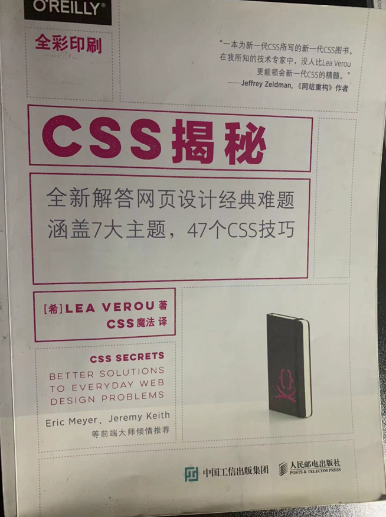

### 记录整理下css揭秘这本书

### 部分约定

- 所使用的js有原生书写。封装了一个工具函数util.js中，后续用到。
- 相关css兼容性，提供查询的address

### 部分优秀的网站，可查询浏览器的相关兼容性

- [Can i Use?](https://caniuse.com/)
- [WebPlatform.org](http://wenplatform.org)
- [Mozilla Developer Network](http://developr.mozilla.org)

### 关于css编码技巧

1： 尽量减少代码重复

在软件开发中，保持代码的DRY和和维护性是最大的挑战之一，对于css也完全适用。在事件中，代码可维护性
最大的要素是减少改动时要编辑的地方。

2：一开始尽可能的进行响应式布局。一下一些建议，可能帮助你避免不必要的媒体查询

- 适用百分比来代替固定长度，或者使用新的视口单位（vw, vh, vmin, vmax）
- 大分辨率下得到固定宽度时，使用max-width而不是width
- 对 img object video iframe等设置一个max-width 为 100%
- 假如背景图片铺满一个容器，不管容器的尺寸如何变化，background-size: cover都可以做到
- 当图片(或者其他元素)以行列进行布局时，让视口的width来决定行列的数量，即弹性盒子（flex）或者displa: inline-block
- 再说 有多列文本时，指定column-width而不是指定column-count。这样 它就可以在比较小的屏幕上自动显示为单列布局

### 对于使用预处理

在大型项目中 使用类似 less scss stylus是非常有必要的，不过从学习的角度来说。预处理并不是完美的

- css的文件体积和复杂度可能失控, 比如很简洁的一段代码，经过变异后成了一大堆
- 预处理器在开发过程中引入了一定程度的延时，虽然要差不多1s的时间去编译，
- 另外。写过的人都知道。预处理每次都会给类上动态增加一个hash值，所以解析的性能肯定下降了一点(虽然很小)
- 个人觉得，很多人对预处理器过度使用，造成依赖，小项目或者完全没有必要使用的。